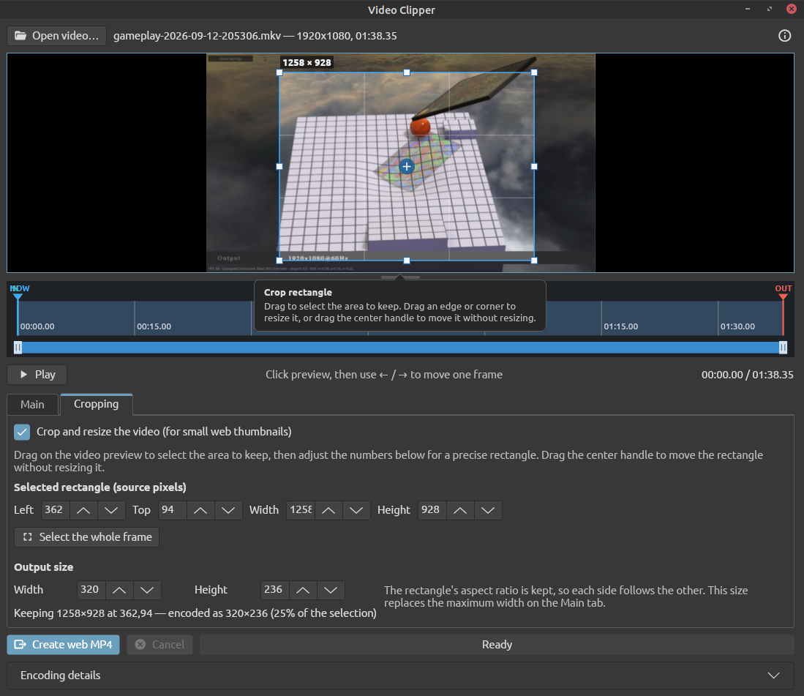

# Video Clipper

A free video trimmer that turns long recordings, such as MKV captures from a capture card, into short, high-quality clips: MP4 for streaming on the web, or OGV for the Godot engine. FFmpeg does the decoding and encoding.

Built with .NET 8 and [Avalonia](https://avaloniaui.net/), so it runs on Linux, Windows and macOS.



## Features

- **Preview**: the video is shown frame by frame, decoded by FFmpeg. Play it (without sound), click or drag along the timeline, or click the preview and press Left / Right to move exactly one frame. Drag the bar under the preview to make it taller or shorter.
- **Timeline**: color-coded IN, OUT and NOW markers. Drag either end of the blue bar below it to zoom in, and drag its middle to scroll.
- **Trimming**: set the start and end in seconds, or to the frame on screen, and jump back to either.
- **Two output formats**:
  - **MP4**: two-pass H.264 (preset `slow`) with AAC audio, aimed at a size limit, with the index at the start of the file so browsers can play and seek before it has all downloaded.
  - **OGV**: Theora video with Vorbis audio at a constant quality, the only video format the Godot engine plays.
- **Size limit**: the video bitrate is worked out from the clip's length and the limit, with a 5% safety margin. **Suggest** fills in a limit that gives good quality for the clip's length, frame rate and output size.
- **Cropping and resizing**: draw a rectangle on the preview (or type it in), and shrink the result to a chosen size, for small thumbnails on a web page.
- **Fades**: 0.5-second audio fades, and 0.5-second video fades from and to black.
- **Remembers** the format, size limit, audio, crop rectangle and output size between sessions.
- **Look and feel**: a dark theme modelled on Linux Mint (Mint-Y-Dark), the Ubuntu font, and Material Design icons.

## Output formats

| | MP4 | OGV |
| --- | --- | --- |
| Video | H.264, `slow` preset | Theora, 4:2:0 |
| Audio | AAC | Vorbis |
| Rate control | two passes, aimed at a size | one pass, constant quality |
| Setting | **Maximum size** in MB | **Quality** from 1 to 9 |

Theora encodes to a quality rather than a bitrate, so an OGV clip has no predictable size. Choosing OGV swaps the Maximum size box for a Quality box (1 is the smallest file, 9 the most detail) and hides the size estimate. Trimming, cropping, resizing, the maximum width and the fades work the same in both.

## Requirements

- [.NET 8 SDK](https://dotnet.microsoft.com/download/dotnet/8.0) (8.0.100 or later)
- [FFmpeg](https://ffmpeg.org/), with `ffmpeg` and `ffprobe` on the PATH. OGV output needs an FFmpeg built with libtheora and libvorbis, as the usual packages are.

NuGet packages (Avalonia) are downloaded automatically on the first build.

### Linux

On Ubuntu / Linux Mint:

```sh
sudo apt install dotnet-sdk-8.0 ffmpeg
```

Avalonia needs an X11 desktop (or XWayland) and fontconfig, which desktop installs already have.

### Windows

```powershell
winget install Microsoft.DotNet.SDK.8
winget install Gyan.FFmpeg
```

### macOS

```sh
brew install --cask dotnet-sdk
brew install ffmpeg
```

## Build and run

The commands are the same on every platform:

```sh
git clone https://github.com/sysrpl/videoclipper.git
cd videoclipper
dotnet build
dotnet run
```

### Stand-alone builds

To make a self-contained program that runs without .NET installed, publish for the target platform (`-r` is the [runtime identifier](https://learn.microsoft.com/dotnet/core/rid-catalog)). FFmpeg is still needed.

```sh
# Linux (x64)
dotnet publish -c Release -r linux-x64 --self-contained -o publish/linux-x64

# Windows (x64)
dotnet publish -c Release -r win-x64 --self-contained -o publish/win-x64

# macOS (Apple silicon / Intel)
dotnet publish -c Release -r osx-arm64 --self-contained -o publish/osx-arm64
dotnet publish -c Release -r osx-x64 --self-contained -o publish/osx-x64
```

Run `videoclipper` (or `videoclipper.exe` on Windows) from the output folder. The version shown in the About screen comes from `<Version>` in `videoclipper.csproj`.

### Installing on Linux

`publish.sh` publishes a Linux build to `~/.local/share/video-clipper` and adds Video Clipper, with its icon, to the Mint menu (and other desktop menus) under Sound & Video:

```sh
./publish.sh
```

## How to use it

1. Select **Open video…** (or press Ctrl+O) and choose the recording.
2. Find the part you want with **Play**, or by clicking and dragging along the timeline. For an exact frame, click the preview and tap Left or Right; hold the key to keep moving.
3. Select **Set to current position** beside Start and End, or type the times in seconds. **Jump to start** and **Jump to end** go back to them.
4. On the **Main** tab, choose where to save the clip and its **Format**. Changing the format changes the file name's extension for you.
5. Set the **Maximum size** (MP4), or press **Suggest**, or set the **Quality** (OGV). Choose the audio bitrate, or **No audio** for a silent clip, and the **Maximum width**.
6. Tick either fade if you want one. A clip must be at least one second long to use fades.
7. Select **Create web MP4** or **Create OGV** and wait for it to finish. MP4 runs two passes and OGV one. **Cancel** stops it, and **Encoding details** shows FFmpeg's progress and any errors.

## Cropping and resizing

The **Cropping** tab does nothing until **Crop and resize the video** is ticked.

1. Tick it. A rectangle appears on the preview, and everything outside it is dimmed.
2. Drag anywhere on the preview to draw a new rectangle. Drag an edge or corner to resize it, or its round center handle to move it.
3. For an exact rectangle, type **Left**, **Top**, **Width** and **Height**. The preview and the numbers always match. **Select the whole frame** starts again from the full picture.
4. Set the **Output size**. The rectangle's shape is always kept, so typing one side works out the other. The line below it sums up what is kept and how much it is shrunk.

While cropping is on, the output size replaces the Maximum width on the Main tab. The rectangle, output size and whether cropping is on are remembered for the next video (and made to fit if that video is smaller).

## Notes

- Crop and output sizes are rounded to even numbers of pixels, which H.264's yuv420p format needs. The rectangle is only ever rounded inward, so it never grows past what was selected.
- Cropped clips are encoded with square pixels, so a browser shows a thumbnail at exactly the size asked for.
- The size limit goes down to 0.1 MB, for very small thumbnails. If the limit is too small for the clip's length, the window says so instead of encoding. Small outputs, such as 320×180, are allowed lower bitrates than full-size video.
- The size limit is in decimal megabytes (1 MB = 1,000,000 bytes). The estimate allows for the safety margin, but unusually complex footage can still come out a little different.
- A maximum width of 1920 pixels is a good choice for a 4K capture: the bitrate goes into a cleaner 1080p picture instead of a heavily compressed 4K one. 1280 pixels can look better for very detailed clips.
- The original recording is never changed, and the clip must be saved under a different name.
- Seeking in a browser before the whole MP4 has downloaded also needs the web server to support byte-range requests, which most do.
- The `slow` preset and two passes favor quality and size over speed, so encoding takes a while.

## Where things are stored

Settings are kept in `settings.json` in your user's app data folder:

| Platform | Folder |
| --- | --- |
| Linux | `~/.config/videoclipper/` |
| Windows | `%APPDATA%\videoclipper\` |
| macOS | `~/Library/Application Support/videoclipper/` |

The first pass of an MP4 encode writes its statistics to a temporary folder, which is deleted afterwards.

## Project layout

```
videoclipper.csproj     project file (packages, version)
publish.sh              Linux install into the desktop menu
src/
  Program.cs, App.axaml   startup, theme and fonts
  Models/                 VideoInfo, crop rectangle and frame size
  Services/               FFmpeg and ffprobe, encoding commands and bitrates (VideoCore),
                          the encoder, preview frame decoding, settings
  Controls/               the zoomable timeline and the crop rectangle
  Views/                  main window, About and message dialogs
  Themes/MintDark.axaml   the dark theme
  Helpers/                icons, tooltips, build information
resources/              app icon, Ubuntu fonts, Material Design Icons font
images/                 screenshots for this README
```

## Credits

- [Avalonia UI](https://avaloniaui.net/) (MIT)
- [FFmpeg](https://ffmpeg.org/) (LGPL / GPL), run as a separate program
- [Material Design Icons](https://pictogrammers.com/library/mdi/) (Apache 2.0)
- [Ubuntu font family](https://design.ubuntu.com/font) (Ubuntu Font Licence 1.0)
- App icon from the [Mint-Y icon theme](https://github.com/linuxmint/mint-y-icons) (GPL 3.0)

## License

MIT; see [LICENSE](LICENSE). The app icon keeps its own GPL 3.0 licence.
